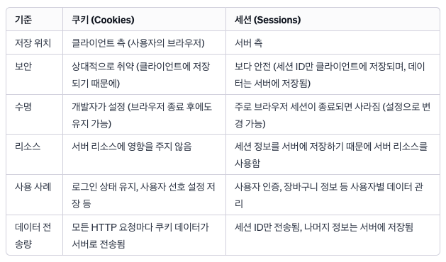

# 이은비

## :minidisc: 쿠키와 세션

### 쿠키와 세션을 사용하는 이유

쿠키는 클라이언트(사용자의 웹 브라우저)에 저장되는 작은 파일로서 사용자의 웹 사이트 경험을 개인화하고 향상시키기 위해서입니다. 예를 들어, **사용자의 선호도와 설정을 기억**하여 **맞춤형 경험**을 제공할 수 있습니다.

사용자의 선호도와 설정을 기억하여 맞춤형 경험을 제공하는 예시는 다음과 같습니다.

1. **언어 설정 기억** : 사용자가 웹사이트에서 선택한 언어를 기억하여, 다음 방문 때 자동으로 해당 언어로 사이트를 표시합니다.
2. **로그인 상태 유지** : 사용자가 웹 사이트에 로그인한 상태를 유지하여, 매번 방문할 때마다 로그인을 요구하지 않습니다.
3. **장바구니 정보 저장** : 온라인 쇼핑 사이트에서 사용자가 장바구니에 추가한 상품 정보를 쿠키에 저장하여, 사용자가 사이트를 나갔다가 다시 방문해도 이전에 선택한 상품들이 장바구니에 그대로 남아있게 합니다.

세션을 사용하는 주된 이유는 **사용자별 상태 정보를 서버 측에서 안전**하게 유지하고 관리하면서 웹 어플리케이션에서 보다 보안적이고 맞춤화된 사용자 경험을 제공하기 위함입니다.

예시는 다음과 같습니다.

1. **사용자 로그인 관리** : 사용자가 웹 사이트에 로그인할 때, 사용자의 로그인 정보(ex. ID)를 세션에 저장합니다. 이후, 사용자가 다른 페이지로 이동할 때마다 서버는 세션 ID를 통해 해당 사용자의 로그인 상태와 관련 정보를 확인하고, 사용자가 로그인한 상태를 유지할 수 있게 합니다.
2. **장바구니 정보 관리** : 온라인 쇼핑몰에서 사용자가 장바구니에 상품을 추가하면, 해당 상품 정보를 사용자의 세션에 저장합니다. 이를 통해 사용자가 사이트 내에서 다른 페이지로 이동하거나, 일정 시간 후에 방문해도 장바구니의 상품이 유지됩니다.
3. **입력 데이터 임시 저장** : 사용자가 입력 과정 중에 페이지를 이탈했다가 다시 돌아와도 이전에 입력했던 데이터를 복원하고, 계속 입력할 수 있게 합니다.

### 세션의 저장 방식

> 주로 서버의 메모리 내에 저장이 됩니다. 대규모 웹 어플리케이션에서는 세션 정보를 데이터베이스, 파일 시스템, 또는 전용 세션 저장소(Redis, Memcached)에 저장하여 더 안정적인 데이터 관리를 수행합니다.

### 세션이 날아가면 어떻게 해야할까?

> 중요한 세션 데이터는 주기적으로 백업하여 데이터 손실에 대비해야 합니다. 데이터베이스, 파일 시스템 또는 외부 저장소를 사용하여 세션을 백업해둬야 합니다.

### 쿠키의 단점

> 쿠키는 사용자의 컴퓨터에 텍스트 파일 형태로 저장되기 때문에, XSS 공격이나 CSRF 공격과 같은 보안 위협에 노출될 수 있습니다. 또한, 데이터가 암호화되지 않은 경우, 네트워크를 통한 데이터 전송 과정에서 민감한 정보가 탈취될 수 있습니다.

### 쿠키 vs 세션

쿠키와 세션은 모두 사용자를 식별하고, 상태 정보를 저장하는 데 사용되지만 중요한 차이점이 있습니다.

<figure><figcaption></figcaption></figure>

* **저장 위치**: 쿠키 데이터는 클라이언트 측에서 관리되는 반면, 세션 데이터는 서버 측에서 관리됩니다.
* **보안성**: 세션은 쿠키에 비해 더 안전합니다. 세션 ID만 가지고 있으면 사용자를 인증할 수 있으며, 이 ID는 서버에서만 접근 가능합니다.
* **수명**: 쿠키는 개발자가 설정한 유효 기간이 지나면 만료되며, 세션은 브라우저가 닫히거나 서버에서 세션을 종료 할 때 까지 유지됩니다.
* **용량 제한**: 쿠키는 각 도메인마다 최대 4KB까지만 저장할 수 있지만, 세션은 서버의 자원 한계에 의해 정해지므로 일반적으로 더 큰 데이터를 저장할 수 있습니다.

### 쿠키와 세션의 조작을 방지하려면?

쿠키와 세션의 조작을 방지하기 위해 다음과 같은 조치를 취할 수 있습니다.

* **Secure 속성**: 쿠키에 Secure 속성을 설정하여 HTTPS 통신에서만 쿠키를 전송하도록 합니다.
* **HttpOnly 속성**: 쿠키에 HttpOnly 속성을 설정하여 JavaScript를 통한 접근을 차단합니다.
* **암호화**: 쿠키와 세션 데이터를 암호화하여 저장합니다.
* **토큰의 유효성 검사**: 서버 측에서 세션 토큰의 유효성을 지속적으로 검사합니다.

## JWT

### JWT를 사용하는 이유

JWT (JSON Web Token)는 인증 및 정보 교환에 사용되는 토큰 기반의 표준입니다. 주요 사용 이유는 다음과 같습니다.

1. **상태 비저장 (stateless)**: 서버 측에서 세션 상태를 유지할 필요 없이, 각 요청에 대한 사용자 정보를 JWT에 포함하여 처리할 수 있습니다.
2. **보안성**: JWT는 디지털 서명되므로 데이터 조작을 방지합니다.
3. **확장성**: 분산 시스템이나 마이크로서비스 아키텍처에서 쉽게 확장 및 통합할 수 있습니다.

### JWT의 단점

* **토큰 크기**: 사용자 정보를 포함하므로 토큰 크기가 클 수 있어 네트워크 부하가 증가할 수 있습니다.
* **취소가 어려움**: 한 번 발급된 JWT는 유효 기간이 지나기 전까지는 서버 측에서 취소가 어렵습니다.
* **보안 위협**: 비록 JWT 자체가 안전하지만, 실수로 암호화되지 않은 채로 전달되거나, 키가 노출될 경우 보안상 위험이 있습니다.
